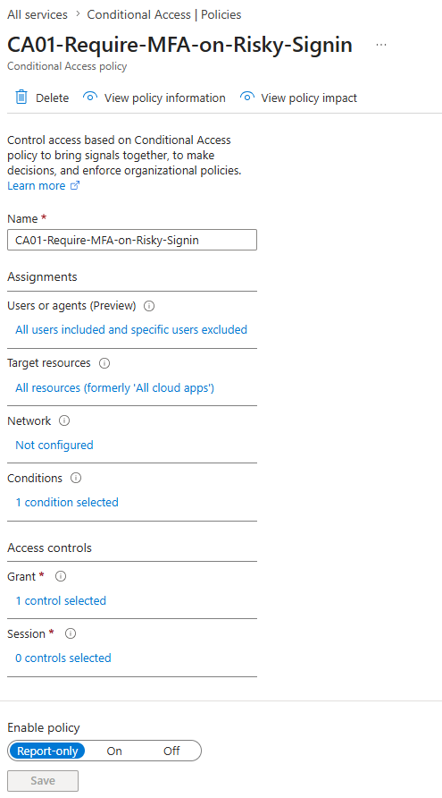
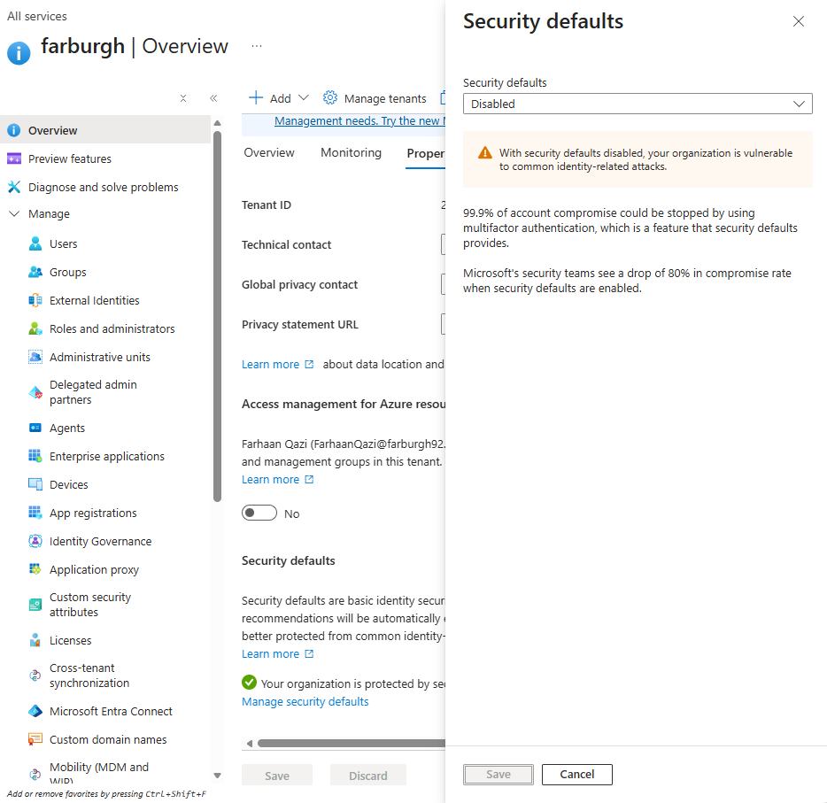
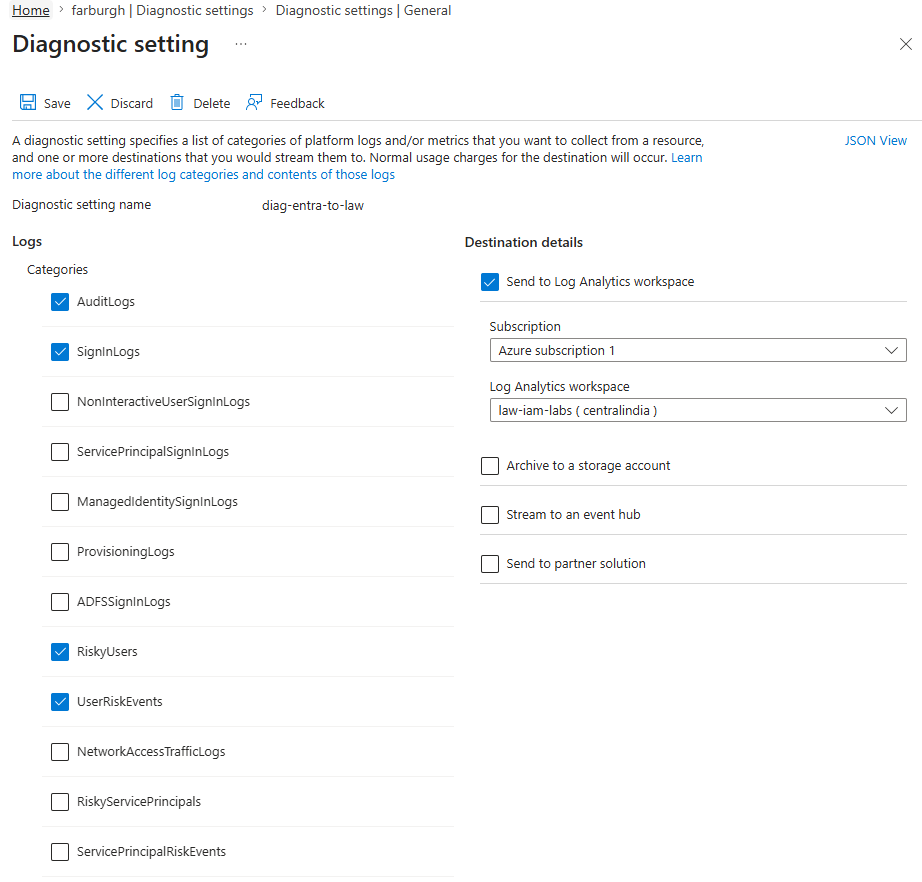
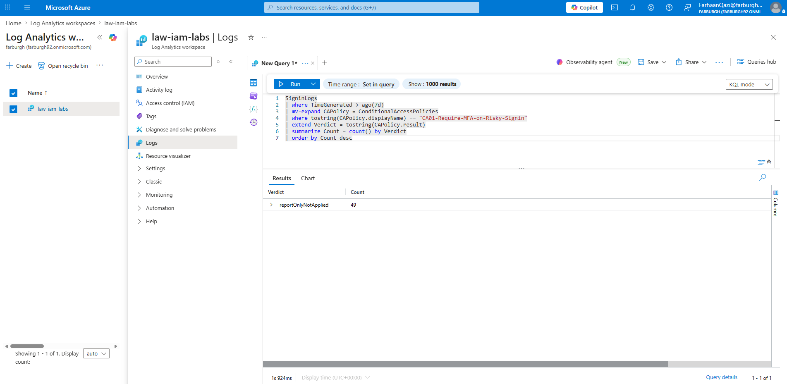

# Lab 1 — Block Risky Sign-ins to Patient Data

**Problem**: A clinician's password is phished. An attacker tries to sign in from an
anonymous IP in another country to reach patient records. Password alone lets them in.
In an NHS or banking context, that single stolen credential is a reportable breach.

**Solution**: A Conditional Access (CA) policy that evaluates the real-time **sign-in
risk** of every login. When risk is Medium or High, it requires multifactor
authentication (MFA) instead of granting access on password alone. Deployed in
**report-only mode** first — it logs what it *would* do without blocking anyone, so the
policy can be validated before enforcement.

**Steps**:
1. Disabled Security Defaults (mutually exclusive with Conditional Access).
2. Created a cloud-only **break-glass** Global Admin account, excluded from all CA
   policies — the spare key against self-lockout.
3. Built CA policy `CA01-Require-MFA-on-Risky-Signin`:
   - **Assignments**: All users (break-glass excluded), All resources.
   - **Conditions**: Sign-in risk = Medium + High.
   - **Access controls**: Grant — Require multifactor authentication.
   - **Enable**: Report-only.
4. Routed Entra `SignInLogs` + `AuditLogs` into Log Analytics workspace `law-iam-labs`
   via a diagnostic setting, so sign-in events become queryable with KQL.

**Proof**:
| Screenshot | Shows |
|---|---|
|  | CA01 in Report-only mode |
|  | Security Defaults disabled |
|  | SignInLogs routed to law-iam-labs |
|  | Risky sign-ins surfaced via KQL |

**Data layer** ([queries/risky-signins.kql](queries/risky-signins.kql)):
The control layer *configures* protection; the data layer *measures* it.
- **Q2** filters `SigninLogs` to Medium/High `RiskLevelDuringSignIn` — the count of risky
  logins caught.
- **Q3** expands the nested `ConditionalAccessPolicies` field to show CA01's verdict per
  sign-in (`reportOnlyFailure` = a login the policy would have challenged) — proof the
  policy actually fired, not just that it exists. **Measured result: 49 sign-ins, all
  `reportOnlyNotApplied`** — CA01 evaluated every login and correctly stood down because
  no risk was present. Zero false positives; the policy is safe to enforce.
- **Q4** renders a daily risk-level trend for a dashboard/Workbook view.

> Trial-tenant note: Entra rarely flags a solo admin's normal logins as risky, so the
> risky-sign-in count may be low or zero. The queries are validated against the live
> `SigninLogs` table regardless — the skill demonstrated is turning raw identity logs
> into a measurable risk signal.

**Interview Answer**:
> "If I were securing patient data, I'd implement a Conditional Access policy keyed on
> sign-in risk, requiring MFA for medium- and high-risk logins, because a stolen password
> shouldn't be enough to reach clinical records. I'd run it in report-only mode first,
> monitor the sign-in logs for false positives, then enforce it on high-risk groups. To
> prove it works I'd query SigninLogs in KQL — counting risky logins caught and showing
> the policy's verdict per sign-in — so I can report coverage to a compliance auditor,
> not just claim it."
